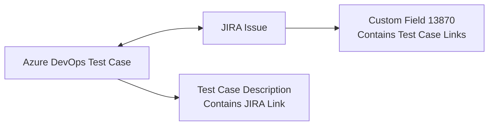

## Project Overview

This is an MCP server that provides AI assistants with tools to manage test cases, work items, and integrations between Azure DevOps and JIRA. The server offers bidirectional linking capabilities and sophisticated workflow management.

## Key Components

### 1. **Configuration Management (`configStore.ts`)**
- Manages environment variables for both platforms:
  - Azure DevOps: `AZDO_ORG`, `AZDO_PROJECT`, `AZDO_PAT`
  - JIRA: `JIRA_API_BASE_URL`, `JIRA_PAT`
- Provides validation and secure retrieval of credentials

### 2. **JIRA Integration (`jiraUtils.ts`)**
- **Core API functionality**: Authenticated requests to JIRA REST API
- **Subtask management**: Create subtasks with predefined templates:
  - **FF (Feature Flag)**: Dev work, QA config, test cases, DevOps story, documentation
  - **Regular**: Dev work, test case creation/execution, linking
  - **Custom**: User-defined subtask lists
- **Cross-platform linking**: Updates JIRA custom field `customfield_13870` with Azure DevOps test case links using Atlassian Document Format (ADF)

### 3. **Azure DevOps Test Management (`testCaseUtils.ts`)**
- **Test case lifecycle**: Create, copy, organize test cases with rich metadata
- **Test suite management**: Automatic creation/discovery of test suites with hierarchical organization
- **Automation linking**: Connect test cases to automated test methods and assemblies
- **JIRA integration**: Bidirectional linking with automatic description updates

### 4. **Main Server (`index.ts`)**
- **Unified item fetching**: Single `fetch-item` tool that intelligently routes to Azure DevOps (numeric IDs) or JIRA (string IDs)
- **MCP tool registration**: Exposes all functionality as callable tools for AI assistants

## Key Features & Workflows

### **Cross-Platform Integration**

### **Test Management Workflow**
1. **Create test cases** with optional JIRA work item linking
2. **Auto-organize** in test suites (creates child suites named after work items)
3. **Copy/reference** test cases between plans and suites
4. **Link to automation** via test method and assembly association
5. **Manage JIRA subtasks** with template-driven creation

### **Advanced Capabilities**
- **ADF manipulation**: Rich text formatting in JIRA custom fields
- **Batch operations**: Handle multiple test cases/subtasks efficiently
- **Template system**: Predefined workflows for different development patterns
- **Configuration validation**: Clear setup guidance for environment variables
- **Error resilience**: Graceful degradation when optional features fail

## Available MCP Tools

The server exposes these tools to AI assistants:

| Tool | Purpose |
|------|---------|
| `fetch-item` | Get details from Azure DevOps or JIRA (auto-detects platform) |
| `create-testcase` | Create test cases with optional JIRA linking and suite organization |
| `add-testcase-to-testsuite` | Add test cases to suites with copy/reference options |
| `copy-testcases-to-testsuite` | Bulk copy test cases between suites/plans |
| `update-automated-test` | Link test cases to automated test methods |
| `create-jira-subtasks` | Create JIRA subtasks with predefined templates |
| `add-testcase-jira` | Associate existing test cases with JIRA issues |
| `get-all-testcases-from-testsuite` | Retrieve test cases from a suite |
| `get-child-test-suites` | Get hierarchical test suite structure |

This architecture enables AI assistants to orchestrate complex test management workflows across both platforms while maintaining data consistency and providing rich cross-platform linking capabilities.