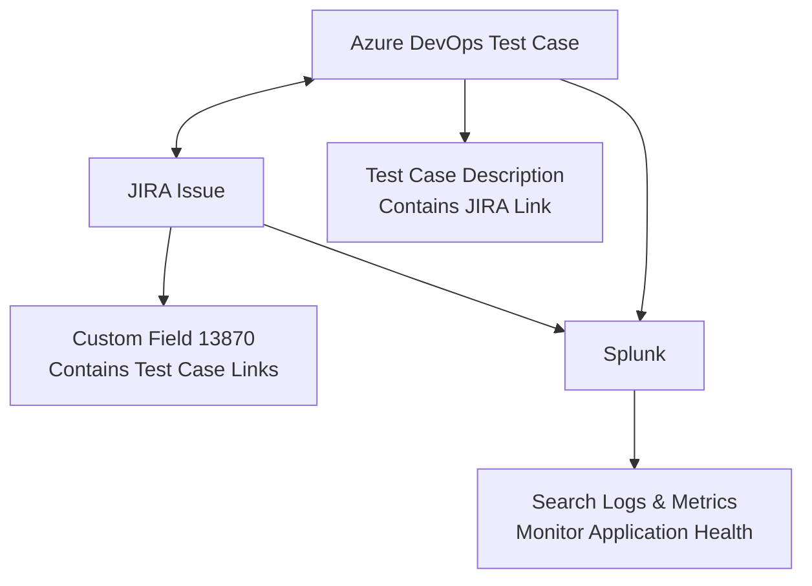
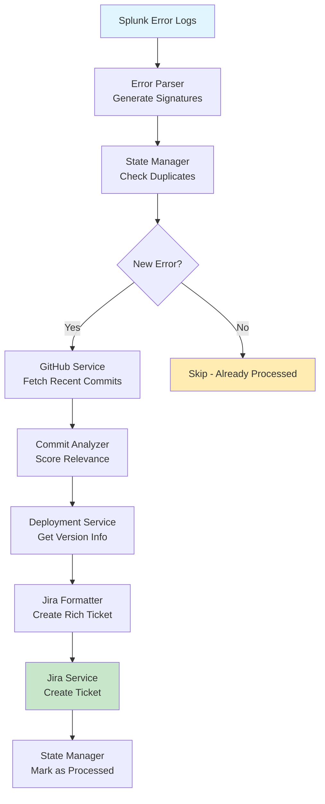
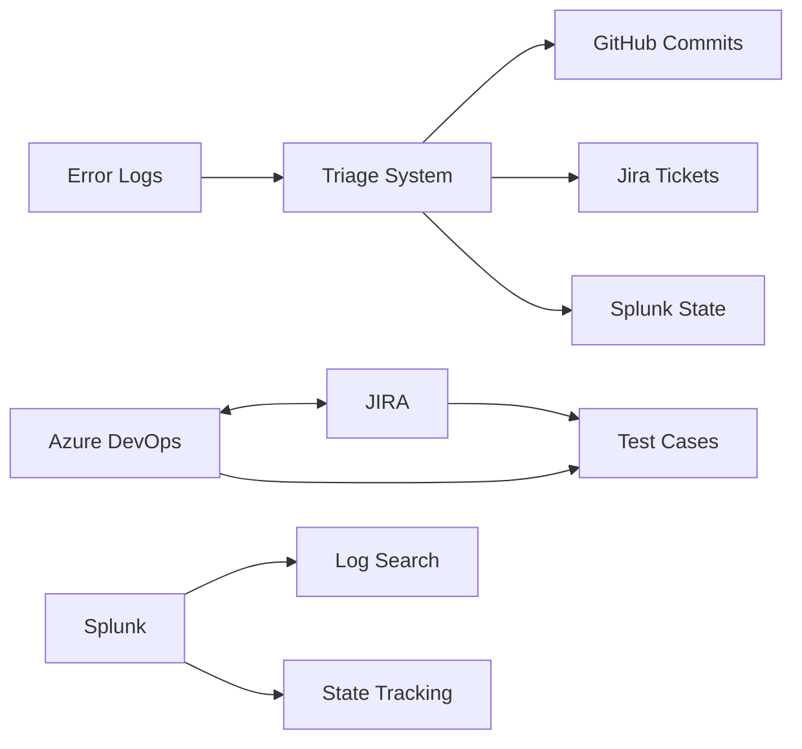

## Project Overview

This is an MCP server that provides AI assistants with tools to manage test cases, work items, and integrations between Azure DevOps, JIRA, and Splunk. The server offers bidirectional linking capabilities, sophisticated workflow management, and observability through Splunk search integration.

## Project Structure

```
azure-devops-mcp/
├── src/                              # Source TypeScript files
│   ├── index.ts                      # Main MCP server entry point
│   ├── configStore.ts                # Environment configuration management
│   ├── testCaseUtils.ts              # Azure DevOps test case management
│   ├── jiraUtils.ts                  # JIRA integration utilities
│   ├── testing.ts                    # Testing utilities
│   ├── integrations/
│   │   └── splunk/                   # Splunk integration (optional)
│   │       ├── client.ts             # Splunk HTTP client with singleton pattern
│   │       ├── types.ts              # TypeScript interfaces and types
│   │       ├── urlBuilder.ts         # Splunk URL builder utility
│   │       ├── endpoints/
│   │       │   └── search.ts         # Search endpoint implementation
│   │       └── tools/
│   │           ├── index.ts          # Tool exports
│   │           └── search.tool.ts    # MCP tool for Splunk search
│   └── triage/                       # Automated error triage system
│       ├── types.ts                  # Triage-related type definitions
│       ├── triageWorkflow.ts         # Main triage orchestration logic
│       ├── triageTool.ts             # MCP tool for triage functionality
│       ├── errorParser.ts            # Error signature generation and grouping
│       ├── githubService.ts          # GitHub API integration for commit analysis
│       ├── commitAnalyzer.ts         # Intelligent commit analysis and scoring
│       ├── deploymentService.ts      # Deployment information service
│       ├── jiraFormatter.ts          # Jira ticket formatting and templates
│       ├── jiraService.ts            # Jira integration for ticket creation
│       └── stateManager.ts           # State management and duplicate prevention
│
├── build/                            # Compiled JavaScript output
│   └── [mirrors src/ structure]
│
├── instructions/                     # Documentation
│   ├── overview.md                   # This file - project overview
│   ├── jira-fetch.md                 # JIRA integration guide
│   ├── jirasubtasks.md              # JIRA subtasks documentation
│   ├── jiraTestCases.md             # JIRA test case linking guide
│   ├── testsuite.md                 # Test suite management guide
│   └── SPLUNK_IMPLEMENTATION_CONTEXT.md  # Splunk integration details
│
├── package.json                      # Project metadata and dependencies
├── tsconfig.json                     # TypeScript compiler configuration
├── README.md                         # User-facing documentation
└── .env (optional)                   # Local environment variables
```

### Key Directories

- **`src/`** - All TypeScript source code
  - Core files for Azure DevOps, JIRA, and configuration management
  - `integrations/` subfolder for modular third-party integrations

- **`build/`** - Compiled JavaScript output (generated by `npm run build`)
  - Mirror of `src/` structure with `.js` files
  - Entry point: `build/index.js`

- **`instructions/`** - Internal documentation for developers and AI assistants
  - Detailed guides for each major feature
  - Implementation context and examples

## Key Components

### 1. **Configuration Management (`configStore.ts`)**
- Manages environment variables for all platforms:
  - Azure DevOps: `AZDO_ORG`, `AZDO_PROJECT`, `AZDO_PAT`
  - JIRA: `JIRA_API_BASE_URL`, `JIRA_PAT`
  - Splunk (optional): `SPLUNK_URL`/`SPLUNK_HOST`, `SPLUNK_PORT`, `SPLUNK_SCHEME`, `SPLUNK_TOKEN`, `VERIFY_SSL`
- Provides validation and secure retrieval of credentials
- Intelligently parses Splunk configuration from full URL or individual components

### 2. **JIRA Integration (`jiraUtils.ts`)**
- **Core API functionality**: Authenticated requests to JIRA REST API
- **Subtask management**: Create subtasks with predefined templates:
  - **FF (Feature Flag)**: Dev work, QA config, test cases, DevOps story, documentation
  - **Regular**: Dev work, test case creation/execution, linking
  - **Custom**: User-defined subtask lists
- **Cross-platform linking**: Updates JIRA custom field `customfield_13870` with Azure DevOps test case links using Atlassian Document Format (ADF)

### 3. **Azure DevOps Test Management (`testCaseUtils.ts`)**
- **Test case lifecycle**: Create, copy, organize test cases with rich metadata
- **Test suite management**: Automatic creation/discovery of test suites with hierarchical organization
- **Automation linking**: Connect test cases to automated test methods and assemblies
- **JIRA integration**: Bidirectional linking with automatic description updates

### 4. **Splunk Integration (`integrations/splunk/`)**
- **Search capability**: Execute SPL queries against Splunk indexes
- **Client management**: Singleton pattern with axios-based HTTP client
- **URL building**: Smart Splunk web UI URL construction from API configuration
- **Error handling**: Custom SplunkError class with detailed error information
- **Optional integration**: Gracefully degrades if Splunk is not configured

### 5. **Automated Error Triage System (`triage/`)**
- **Error Analysis**: Intelligent error signature generation and grouping
- **GitHub Integration**: Real-time commit analysis to identify potential root causes
- **Commit Scoring**: Relevance-based scoring system for suspected commits
- **Jira Automation**: Comprehensive ticket creation with investigation context
- **State Management**: Splunk-based duplicate prevention and processing history
- **Multi-Service Support**: Handles errors across different services and environments

### 6. **Main Server (`index.ts`)**
- **Unified item fetching**: Single `fetch-item` tool that intelligently routes to Azure DevOps (numeric IDs) or JIRA (string IDs)
- **MCP tool registration**: Exposes all functionality as callable tools for AI assistants
- **Optional services**: Splunk and GitHub integrations are optional and auto-detected at startup

## Key Features & Workflows

### **Multi-Platform Integration**


### **Test Management Workflow**
1. **Create test cases** with optional JIRA work item linking
2. **Auto-organize** in test suites (creates child suites named after work items)
3. **Copy/reference** test cases between plans and suites
4. **Link to automation** via test method and assembly association
5. **Manage JIRA subtasks** with template-driven creation
6. **Monitor with Splunk** - search logs and metrics for test execution and application health

### **Advanced Capabilities**
- **ADF manipulation**: Rich text formatting in JIRA custom fields
- **Batch operations**: Handle multiple test cases/subtasks efficiently
- **Template system**: Predefined workflows for different development patterns
- **Configuration validation**: Clear setup guidance for environment variables
- **Error resilience**: Graceful degradation when optional features fail

## Available MCP Tools

The server exposes these tools to AI assistants:

| Tool | Purpose |
|------|---------|
| `fetch-item` | Get details from Azure DevOps or JIRA (auto-detects platform) |
| `create-testcase` | Create test cases with optional JIRA linking and suite organization |
| `add-testcase-to-testsuite` | Add test cases to suites with copy/reference options |
| `copy-testcases-to-testsuite` | Bulk copy test cases between suites/plans |
| `update-automated-test` | Link test cases to automated test methods |
| `create-jira-subtasks` | Create JIRA subtasks with predefined templates |
| `add-testcase-jira` | Associate existing test cases with JIRA issues |
| `get-all-testcases-from-testsuite` | Retrieve test cases from a suite |
| `get-child-test-suites` | Get hierarchical test suite structure |
| `search_splunk` | Execute SPL queries to search Splunk logs and metrics (optional) |
| `triage_splunk_error` | Automatically analyze production errors and create Jira triage tickets with GitHub commit analysis (requires GitHub token) |

This architecture enables AI assistants to orchestrate complex test management workflows across multiple platforms while maintaining data consistency, providing rich cross-platform linking capabilities, and offering observability through integrated Splunk search.

## Integration Architecture

The system integrates four major platforms:

1. **Azure DevOps** - Core test management and work item tracking
2. **JIRA** - Issue tracking and project management with bidirectional linking
3. **Splunk** (optional) - Observability, log analysis, and metrics monitoring
4. **GitHub** (optional) - Code repository analysis for automated error triage

### **Automated Error Triage Workflow**


### **Cross-Platform Data Flow**


All integrations are designed to be optional and fail gracefully, ensuring the core Azure DevOps/JIRA functionality remains available even if optional services (Splunk, GitHub) are not configured.

## Example MCP Tool Usage

### Error Triage Example
```typescript
// Analyze production errors automatically
const result = await mcp.call("triage_splunk_error", {
  errorMessages: [
    "Database connection timeout in OrderService.processOrder()",
    "NullPointerException in UserService.validateSession()",
    "API rate limit exceeded in PaymentService.charge()"
  ],
  repositoryName: "ecommerce/order-service",
  commitLookbackDays: 5,
  createTickets: true
});
```

### Integrated Workflow Example
```typescript
// Complete test management workflow
async function createTestWithMonitoring() {
  // 1. Create test case
  const testCase = await mcp.call("create-testcase", {
    title: "Order processing error handling",
    steps: "1. Submit invalid order\nExpected: Proper error message",
    jiraWorkItemId: "PROD-123"
  });
  
  // 2. Monitor related errors
  const errors = await mcp.call("search_splunk", {
    search_query: "index=app_logs service=order-service level=ERROR",
    earliest_time: "-24h"
  });
  
  // 3. Auto-triage any new errors
  if (errors.length > 0) {
    const errorMessages = errors.map(e => e.message);
    await mcp.call("triage_splunk_error", {
      errorMessages: errorMessages,
      repositoryName: "ecommerce/order-service",
      createTickets: true
    });
  }
}
```